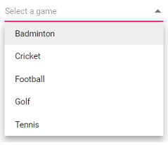

# Getting Started

This section explains how to use Syncfusion Vue DropDownList components in Vue 3 application.

## Prerequisites

* `vue` : `3+`
* `node` : `10.15+`
* `vue-class-component` : `8.0.0-rc.1`

## Creating Vue application using Vue CLI

The easiest way to create a Vue application is to use the [`Vue CLI`](https://github.com/vuejs/vue-cli). Vue CLI versions above [`4.5.0`](https://v3.vuejs.org/guide/migration/introduction.html#vue-cli) are mandatory for creating applications using Vue 3. Use the following command to uninstall older versions of the Vue CLI.

```bash
npm uninstall vue-cli -g
```

Use the following commands to install the latest version of Vue CLI.

```bash
npm install -g @vue/cli
npm install -g @vue/cli-init
```

Create a new project using the command below.

```bash
vue create quickstart
```

Initiating a new project prompts us to choose the type of project to be used for the current application. Select the option `Default (Vue 3 Preview)` from the menu.


## Adding Syncfusion DropDownList package in the application

 Syncfusion Vue packages are maintained in the [`npmjs.com`](https://www.npmjs.com/~syncfusionorg) registry.
The DropDownList component will be used in this example. To install it use the following command.

```bash
npm install @syncfusion/ej2-vue-dropdowns --save
```

## Adding CSS reference for Syncfusion Vue DropDownList component

Import the needed css styles for the DropDownList component along with dependency styles in the `<script>` section of the `src/App.vue` file as follows.

```html
<style>
@import "../node_modules/@syncfusion/ej2-base/styles/material.css";
@import "../node_modules/@syncfusion/ej2-inputs/styles/material.css";
@import "../node_modules/@syncfusion/ej2-vue-dropdowns/styles/material.css";
</style>
```

## Adding Syncfusion Vue DropDownList component in the application

You have completed all the necessary configurations needed for rendering the Syncfusion Vue component. Now, you are going to add the DropDownList component using following steps.

Import the DropDownList component in the `<script>` section of the `src/App.vue` file.

```html
<script>
import { DropDownListComponent } from "@syncfusion/ej2-vue-dropdowns";
</script>
```

Register the DropDownList component.

 ```js
import { DropDownListComponent } from "@syncfusion/ej2-vue-dropdowns";
//Component registeration
export default {
    name: "App",
    components: {
        'ejs-dropdownlist' : DropDownListComponent,
    }
}
```

Add the component definition in template section.

```html
<template>
    <div class="control_wrapper">
       <ejs-dropdownlist id='dropdownlist' :dataSource='sportsData'></ejs-dropdownlist>
    </div>
</template>
```

Summarizing the above steps, update the `src/App.vue` file with following code.

```html
<template>
    <div class="control_wrapper">
        <ejs-dropdownlist id='dropdownlist' :dataSource='sportsData'></ejs-dropdownlist>
    </div>
</template>
<script>
import { DropDownListComponent } from "@syncfusion/ej2-vue-dropdowns";
//Component registeration
export default {
    name: 'App',
    components: {
        "ejs-dropdownlist": DropDownListComponent
    },
    data () {
        return {
            sportsData: ['Badminton', 'Cricket', 'Football', 'Golf', 'Tennis']
        }
    }
}
</script>
```

## Running the application

Run the application using the following command.

```bash
npm run serve
```

## Configure the Popup List

By default, the width of the popup list automatically adjusts according to the DropDownList input
element's width, and the height of the popup list has '300px'.

The height and width of the popup list can also be customized using the
[popupHeight](../api/drop-down-list/#popupheight)
&nbsp;and [popupWidth](../api/drop-down-list/#popupwidth) properties
respectively

```html
<template>
  <div id="app">
    <div id='container' style="margin:50px auto 0; width:250px;">
        <br>
        <ejs-dropdownlist id='dropdownlist' popupHeight="200px" popupWidth="250px" :dataSource='sportsData' placeholder='Select a game'></ejs-dropdownlist>
    </div>
  </div>
</template>
<script>
import { DropDownListComponent } from "@syncfusion/ej2-vue-dropdowns";
//Component registeration
export default {
    name: 'App',
    components: {
        "ejs-dropdownlist": DropDownListComponent
    },
    data (){
        return {
            sportsData: ['Badminton', 'Cricket', 'Football', 'Golf', 'Tennis'],
        }
    }
}
</script>
<style>
@import "../../node_modules/@syncfusion/ej2-base/styles/material.css";
@import "../../node_modules/@syncfusion/ej2-inputs/styles/material.css";
@import "../../node_modules/@syncfusion/ej2-vue-dropdowns/styles/material.css";
</style>
```

Output be like the below.



## See Also

* [How to bind the data](./data-binding/)