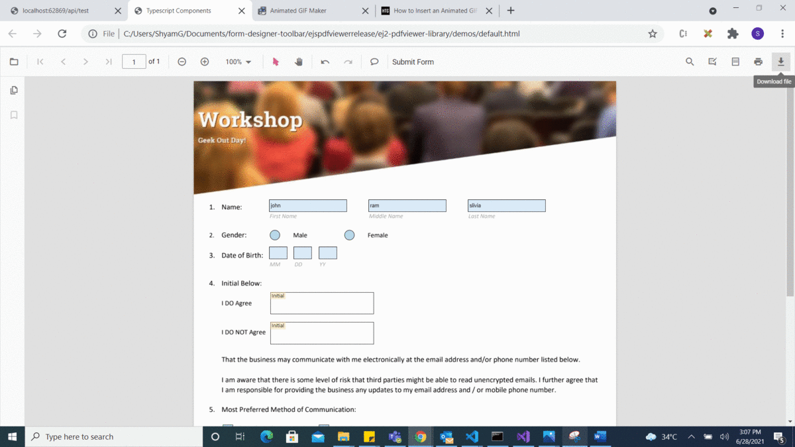
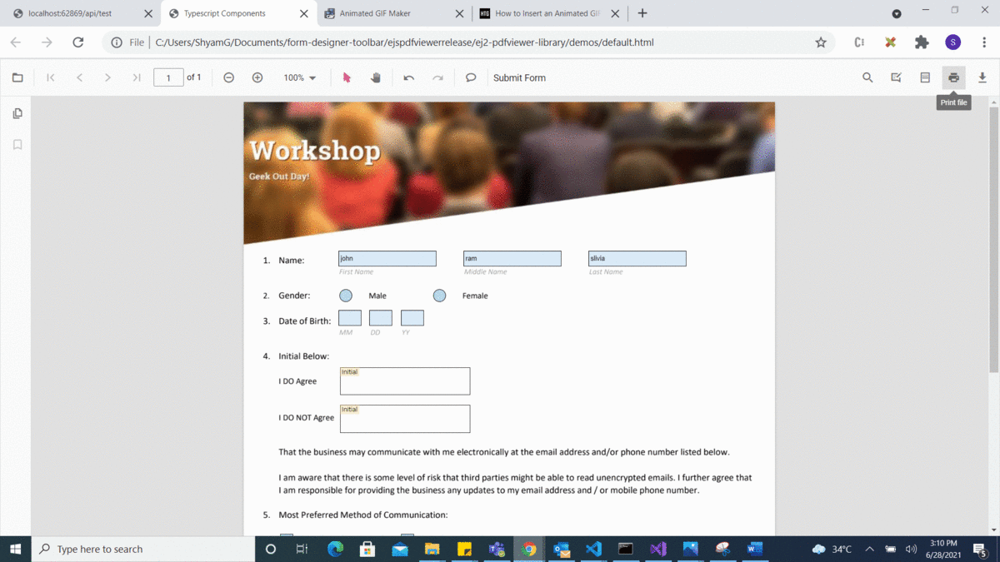

# Create Programmatically

The PDF Viewer control provides the option to add, edit and delete the Form Fields. The Form Fields type supported by the PDF Viewer Control are:

    * Textbox
    * Password
    * CheckBox
    * RadioButton
    * ListBox
    * DropDown
    * SignatureField
    * InitialField

## Add a form field to PDF document programmatically

Using addFormField method, the form fields can be added to the PDF document programmatically. We need to pass two parameters in this method. They are Form Field Type and Properties of Form Field Type. To add form field programmatically, Use the following code.



```html
<template>
    <div id="app">
         <ejs-pdfviewer id="pdfViewer" ref="pdfviewer" :serviceUrl="serviceUrl" :documentPath="documentPath" :documentLoad="documentLoad"> </ejs-pdfviewer>
    </div>
</template>
<script>
import Vue from 'vue';
import { PdfViewerPlugin, Toolbar, Magnification, Navigation, LinkAnnotation, BookmarkView, ThumbnailView, Print, TextSelection, TextSearch, Annotation, FormDesigner, FormFields } from '@syncfusion/ej2-vue-pdfviewer';
Vue.use(PdfViewerPlugin);
export default {
  name: 'app',
  data () {
    return {
      serviceUrl:"https://ej2services.syncfusion.com/production/web-services/api/pdfviewer",
      documentPath:"FormDesigner.pdf"
      };
      },
  provide: {
    PdfViewer: [Toolbar, Magnification, Navigation, LinkAnnotation, BookmarkView, ThumbnailView, Print, TextSelection, TextSearch, Annotation, FormDesigner, FormFields]
  },
  methods: {
    documentLoad: function (args) {
        viewer = this.$refs.pdfviewer.ej2Instances;
        viewer.formDesignerModule.addFormField("Textbox", { name: "Textbox", bounds: { X: 146, Y: 229, Width: 150, Height: 24 } });

    }
  }
}
</script>
<style>
@import '../node_modules/@syncfusion/ej2-base/styles/material.css';
@import '../node_modules/@syncfusion/ej2-buttons/styles/material.css';
@import '../node_modules/@syncfusion/ej2-dropdowns/styles/material.css';  
@import '../node_modules/@syncfusion/ej2-inputs/styles/material.css';  
@import '../node_modules/@syncfusion/ej2-navigations/styles/material.css';
@import '../node_modules/@syncfusion/ej2-popups/styles/material.css';
@import '../node_modules/@syncfusion/ej2-splitbuttons/styles/material.css';
@import '../node_modules/@syncfusion/ej2-lists/styles/material.css';
@import '../node_modules/@syncfusion/ej2-vue-pdfviewer/styles/material.css';
#pdfViewer {
  height: 640px;
}
</style>
```



## Edit/Update form field programmatically

Using updateFormField method, Form Field can be updated programmatically. We should get the Form Field object/Id from FormFieldCollections property that you would like to edit and pass it as a parameter to updateFormField method. The second parameter should be the properties that you would like to update for Form Field programmatically. We have updated the value and background Color properties of Textbox Form Field.



```html
<template>
    <div id="app">
         <ejs-pdfviewer id="pdfViewer" ref="pdfviewer" :serviceUrl="serviceUrl" :documentPath="documentPath" :documentLoad="documentLoad"> </ejs-pdfviewer>
    </div>
</template>
<script>
import Vue from 'vue';
import { PdfViewerPlugin, Toolbar, Magnification, Navigation, LinkAnnotation, BookmarkView, ThumbnailView, Print, TextSelection, TextSearch, Annotation, FormDesigner, FormFields } from '@syncfusion/ej2-vue-pdfviewer';
Vue.use(PdfViewerPlugin);
export default {
  name: 'app',
  data () {
    return {
      serviceUrl:"https://ej2services.syncfusion.com/production/web-services/api/pdfviewer",
      documentPath:"FormDesigner.pdf"
      };
      },
  provide: {
    PdfViewer: [Toolbar, Magnification, Navigation, LinkAnnotation, BookmarkView, ThumbnailView, Print, TextSelection, TextSearch, Annotation, FormDesigner, FormFields]
  },
  methods: {
    documentLoad: function (args) {
        viewer = this.$refs.pdfviewer.ej2Instances;  
        viewer.formDesignerModule.addFormField("Textbox", { name: "Textbox", bounds: { X: 146, Y: 229, Width: 150, Height: 24 } });
        viewer.formDesignerModule.addFormField("Textbox", { name: "Textfield", bounds: { X: 300, Y: 229, Width: 150, Height: 24 } });
        viewer.formDesignerModule.updateFormField(pdfviewer.formFieldCollections[0], { backgroundColor: 'red' });
    }
  }
}
</script>
<style>
@import '../node_modules/@syncfusion/ej2-base/styles/material.css';
@import '../node_modules/@syncfusion/ej2-buttons/styles/material.css';
@import '../node_modules/@syncfusion/ej2-dropdowns/styles/material.css';  
@import '../node_modules/@syncfusion/ej2-inputs/styles/material.css';  
@import '../node_modules/@syncfusion/ej2-navigations/styles/material.css';
@import '../node_modules/@syncfusion/ej2-popups/styles/material.css';
@import '../node_modules/@syncfusion/ej2-splitbuttons/styles/material.css';
@import '../node_modules/@syncfusion/ej2-lists/styles/material.css';
@import '../node_modules/@syncfusion/ej2-vue-pdfviewer/styles/material.css';
#pdfViewer {
  height: 640px;
}
</style>
```



## Delete form field programmatically

Using deleteFormField method, the form field can be deleted programmatically. We should retrieve the Form Field object/Id from FormFieldCollections property that you would like to delete and pass it as a parameter to deleteFormField method. To delete a Form Field programmatically, use the following code.



```html
<template>
    <div id="app">
         <ejs-pdfviewer id="pdfViewer" ref="pdfviewer" :serviceUrl="serviceUrl" :documentPath="documentPath" :documentLoad="documentLoad"> </ejs-pdfviewer>
    </div>
</template>
<script>
import Vue from 'vue';
import { PdfViewerPlugin, Toolbar, Magnification, Navigation, LinkAnnotation, BookmarkView, ThumbnailView, Print, TextSelection, TextSearch, Annotation, FormDesigner, FormFields } from '@syncfusion/ej2-vue-pdfviewer';
Vue.use(PdfViewerPlugin);
export default {
  name: 'app',
  data () {
    return {
      serviceUrl:"https://ej2services.syncfusion.com/production/web-services/api/pdfviewer",
      documentPath:"FormDesigner.pdf"
      };
      },
  provide: {
    PdfViewer: [Toolbar, Magnification, Navigation, LinkAnnotation, BookmarkView, ThumbnailView, Print, TextSelection, TextSearch, Annotation, FormDesigner, FormFields]
  },
  methods: {
    documentLoad: function (args) {
        viewer = this.$refs.pdfviewer.ej2Instances;  
        viewer.formDesignerModule.addFormField("Textbox", { name: "Textbox", bounds: { X: 146, Y: 229, Width: 150, Height: 24 } } as TextFieldSettings);
        viewer.formDesignerModule.addFormField("Textbox", { name: "Textfield", bounds: { X: 300, Y: 229, Width: 150, Height: 24 } } as TextFieldSettings);
        viewer.formDesignerModule.deleteFormField(pdfviewer.formFieldCollections[0] });
    }
  }
}
</script>
<style>
@import '../node_modules/@syncfusion/ej2-base/styles/material.css';
@import '../node_modules/@syncfusion/ej2-buttons/styles/material.css';
@import '../node_modules/@syncfusion/ej2-dropdowns/styles/material.css';  
@import '../node_modules/@syncfusion/ej2-inputs/styles/material.css';  
@import '../node_modules/@syncfusion/ej2-navigations/styles/material.css';
@import '../node_modules/@syncfusion/ej2-popups/styles/material.css';
@import '../node_modules/@syncfusion/ej2-splitbuttons/styles/material.css';
@import '../node_modules/@syncfusion/ej2-lists/styles/material.css';
@import '../node_modules/@syncfusion/ej2-vue-pdfviewer/styles/material.css';
#pdfViewer {
  height: 640px;
}
</style>
```



## Saving the form fields

When the download icon is selected on the toolbar, the Form Fields will be saved in the PDF document and this action will not affect the original document. Refer the below GIF for further reference.



You can invoke download action using following code snippet.

```html
<template>
  <div id="app">
    <ejs-button ref="downloadBtn" v-on:click.native="downloadClicked">Download</ejs-button>
    <ejs-pdfviewer id="pdfViewer" ref="pdfviewer" :serviceUrl="serviceUrl" :documentPath="documentPath" :documentLoad="documentLoad"> </ejs-pdfviewer>
  </div>
</template>

<script>
import Vue from 'vue';
import { PdfViewerPlugin, Toolbar, Magnification, Annotation, Navigation, LinkAnnotation, BookmarkView, ThumbnailView, Print, TextSelection, TextSearch,Annotation, FormDesigner,FormFields } from '@syncfusion/ej2-vue-pdfviewer';
import { ButtonPlugin } from "@syncfusion/ej2-vue-buttons";
Vue.use(ButtonPlugin);
Vue.use(PdfViewerPlugin);
var viewer;
export default {
  name: 'app',
  data () {
    return {
      serviceUrl:"https://ej2services.syncfusion.com/production/web-services/api/pdfviewer"
      documentPath:"PDF_Succinctly.pdf"
      };
      },
  provide: {
    PdfViewer: [Toolbar, Magnification, Navigation, LinkAnnotation, Annotation, BookmarkView, ThumbnailView, Print, TextSelection, TextSearch, Annotation, FormDesigner,FormFields]
  },  
  methods: {
            downloadClicked: function (args) {
                viewer.download();
            },
            documentLoad: function (args) {
                viewer = this.$refs.pdfviewer.ej2Instances;
            },
  }
}
</script>

```

## Printing the form fields

When the print icon is selected on the toolbar, the PDF document will be printed along with the Form Fields added to the pages and this action will not affect the original document. Refer the below GIF for further reference.



You can invoke print action using the following code snippet.,

```html
<template>
  <div id="app">
    <ejs-button ref="printBtn" v-on:click.native="printClicked">Print</ejs-button>
    <ejs-pdfviewer id="pdfViewer" ref="pdfviewer" :serviceUrl="serviceUrl" :documentPath="documentPath" :documentLoad="documentLoad"> </ejs-pdfviewer>
  </div>
</template>

<script>
import Vue from 'vue';
import { PdfViewerPlugin, Toolbar, Magnification, Navigation, LinkAnnotation, Annotation, BookmarkView, ThumbnailView, Print, TextSelection, TextSearch, Annotation, FormDesigner,FormFields } from '@syncfusion/ej2-vue-pdfviewer';
import { ButtonPlugin } from "@syncfusion/ej2-vue-buttons";
Vue.use(ButtonPlugin);
Vue.use(PdfViewerPlugin);
var viewer;
export default {
  name: 'app',
  data () {
    return {
      serviceUrl:"https://ej2services.syncfusion.com/production/web-services/api/pdfviewer"
      documentPath:"PDF_Succinctly.pdf"
      };
      },
  provide: {
    PdfViewer: [Toolbar, Magnification, Navigation, LinkAnnotation, BookmarkView, Annotation, ThumbnailView, Print, TextSelection, TextSearch, Annotation, FormDesigner,FormFields]
  },  
  methods: {
            printClicked: function (args) {
                viewer.print();
            },
            documentLoad: function (args) {
                viewer = this.$refs.pdfviewer.ej2Instances;
            },
  }
}
</script>

```

## Open the existing PDF document

We can open the already saved PDF document contains Form Fields in it by clicking the open icon in the toolbar. Refer the below GIF for further reference.


## Validate form fields

The form fields in the PDF Document will be validated when the `enableFormFieldsValidation` is set to true and hook the validateFormFields. The validateFormFields will be triggered when the PDF document is downloaded or printed with the non-filled form fields. The non-filled fields will be obtained in the `nonFillableFields` property of the event arguments of validateFormFields.

Add the following code snippet to validate the form fields,

```html
<template>
    <div id="app">
         <ejs-pdfviewer id="pdfViewer" ref="pdfviewer" :serviceUrl="serviceUrl" :documentPath="documentPath" :documentLoad="documentLoad" :enableFormFieldsValidation="true" :validateFormFields="validateFormFields"> </ejs-pdfviewer>
    </div>
</template>
<script>
import Vue from 'vue';
import { PdfViewerPlugin, Toolbar, Magnification, Navigation, LinkAnnotation, BookmarkView, ThumbnailView, Print, TextSelection, TextSearch, Annotation, FormDesigner, FormFields } from '@syncfusion/ej2-vue-pdfviewer';
Vue.use(PdfViewerPlugin);
export default {
  name: 'app',
  data () {
    return {
      serviceUrl:"https://ej2services.syncfusion.com/production/web-services/api/pdfviewer",
      documentPath:"FormDesigner.pdf"
      };
      },
  provide: {
    PdfViewer: [Toolbar, Magnification, Navigation, LinkAnnotation, BookmarkView, ThumbnailView, Print, TextSelection, TextSearch, Annotation, FormDesigner, FormFields]
  },
  methods: {
    documentLoad: function (args) {
        viewer = this.$refs.pdfviewer.ej2Instances;
        viewer.formDesignerModule.addFormField("Textbox", { name: "Textbox", bounds: { X: 146, Y: 229, Width: 150, Height: 24 } });

    }
    validateFormFields: function(args){
      var nonfilledFormFields = args.nonFillableFields
    }
  }
}
</script>
<style>
@import '../node_modules/@syncfusion/ej2-base/styles/material.css';
@import '../node_modules/@syncfusion/ej2-buttons/styles/material.css';
@import '../node_modules/@syncfusion/ej2-dropdowns/styles/material.css';  
@import '../node_modules/@syncfusion/ej2-inputs/styles/material.css';  
@import '../node_modules/@syncfusion/ej2-navigations/styles/material.css';
@import '../node_modules/@syncfusion/ej2-popups/styles/material.css';
@import '../node_modules/@syncfusion/ej2-splitbuttons/styles/material.css';
@import '../node_modules/@syncfusion/ej2-lists/styles/material.css';
@import '../node_modules/@syncfusion/ej2-vue-pdfviewer/styles/material.css';
#pdfViewer {
  height: 640px;
}
</style>
```