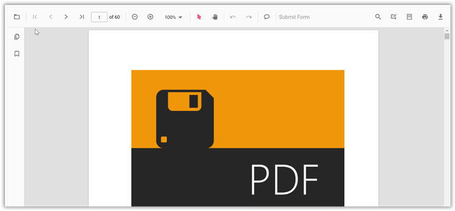

# Getting Started with Syncfusion PDF Viewer Component in Vue 3

This section explains how to use PDF Viewer component in Vue 3 application.

## Prerequisites

* `vue` : `3+`
* `node` : `10.15+`
* `vue-class-component` : `8.0.0-rc.1`

## Create Vue application using Vue CLI

The easiest way to create a Vue application is to use the [`Vue CLI`](https://github.com/vuejs/vue-cli). Vue CLI versions above [`4.5.0`](https://v3.vuejs.org/guide/migration/introduction.html#vue-cli) are mandatory for creating applications using Vue 3. Use the following command to uninstall older versions of the Vue CLI.

```bash
npm uninstall vue-cli -g
```

Use the following commands to install the latest version of Vue CLI.

```bash
npm install -g @vue/cli
npm install -g @vue/cli-init
```

Create a new project using the command below.

```bash
vue create quickstart
```

Add the below command to install npm to project.

```bash
cd quickstart
npm install
```

Initiating a new project prompts us to choose the type of project to be used for the current application. Select the option `Default (Vue 3 Preview)` from the menu.


## Add Syncfusion PDF Viewer package in the application

 Syncfusion Vue packages are maintained in the [`npmjs.com`](https://www.npmjs.com/~syncfusionorg) registry.
 To install PDF Viewer component, use the following command.

```bash
npm install @syncfusion/ej2-vue-pdfviewer --save
```

N> The **--save** will instruct NPM to include the PDF Viewer package inside the `dependencies` section of the `package.json`.

## Add CSS reference for Syncfusion Vue PDF Viewer component

The PDF Viewer has different themes. They are:
* Material
* Fabric
* Bootstrap
* High Contrast

Import the needed css styles for the PDF Viewer component along with dependency styles in the `<script>` section of the `src/App.vue` file as follows.

```html
<script>
import '../node_modules/@syncfusion/ej2-base/styles/material.css';
import '../node_modules/@syncfusion/ej2-buttons/styles/material.css';
import '../node_modules/@syncfusion/ej2-dropdowns/styles/material.css';  
import '../node_modules/@syncfusion/ej2-inputs/styles/material.css';  
import '../node_modules/@syncfusion/ej2-navigations/styles/material.css';
import '../node_modules/@syncfusion/ej2-popups/styles/material.css';
import '../node_modules/@syncfusion/ej2-splitbuttons/styles/material.css';
import '../node_modules/@syncfusion/ej2-lists/styles/material.css';
import '../node_modules/@syncfusion/ej2-vue-pdfviewer/styles/material.css';
</script>
```

N> PDF Viewer component use other Syncfusion components too, the dependent component's CSS references need to be added for using all the PDF Viewer functionalities.

## Add Syncfusion Vue PDF Viewer component in the application

You have completed all the necessary configurations needed for rendering the Syncfusion Vue component. Now, you are going to add the PDF viewer component using following steps.

**Step 1:** Import the PDF Viewer component in the `<script>` section of the `src/App.vue` file.

```html
<script>
import { PdfViewerComponent, Toolbar, Magnification, Navigation, LinkAnnotation, BookmarkView, ThumbnailView, Print, TextSelection, TextSearch, Annotation, FormDesigner, FormFields } from '@syncfusion/ej2-vue-pdfviewer';
</script>
```

**Step 2:** Register the the PDF Viewer component in your application.

```js
//Component registeration
export default {
name: 'App',
// Declaring component and its directives
components: {
"ejs-pdfviewer": PdfViewerComponent
},
```

**Step 3:** Add the component definition in template section.

```html
<template>
    <ejs-pdfviewer id="pdfViewer" :serviceUrl="serviceUrl" :documentPath="documentPath"> </ejs-pdfviewer>
</template>

```

**Step 4:** Declare the bound properties `serviceUrl` and `documentPath` in the `script` section.

  ```js
  data () {
    return {
      serviceUrl:"https://ej2services.syncfusion.com/production/web-services/api/pdfviewer",
      documentPath:"PDF_Succinctly.pdf"
    };
  },
  ```

**Step 5:** Summarizing the above steps, update the `src/App.vue` file with following code.

  ```html
  <template>
  <ejs-pdfviewer id="pdfViewer" :serviceUrl="serviceUrl" :documentPath="documentPath"> </ejs-pdfviewer>
  </template>

  <script>
  import { PdfViewerComponent, Toolbar, Magnification, Navigation, LinkAnnotation, BookmarkView, ThumbnailView, Print, TextSelection, TextSearch, Annotation, FormDesigner, FormFields } from '@syncfusion/ej2-vue-pdfviewer';
  import '../node_modules/@syncfusion/ej2-base/styles/material.css';
  import '../node_modules/@syncfusion/ej2-buttons/styles/material.css';
  import '../node_modules/@syncfusion/ej2-dropdowns/styles/material.css';  
  import '../node_modules/@syncfusion/ej2-inputs/styles/material.css';  
  import '../node_modules/@syncfusion/ej2-navigations/styles/material.css';
  import '../node_modules/@syncfusion/ej2-popups/styles/material.css';
  import '../node_modules/@syncfusion/ej2-splitbuttons/styles/material.css';
  import '../node_modules/@syncfusion/ej2-lists/styles/material.css';
  import '../node_modules/@syncfusion/ej2-vue-pdfviewer/styles/material.css';

  //Component registeration
  export default {
  name: 'App',
  // Declaring component and its directives
  components: {
  "ejs-pdfviewer": PdfViewerComponent
  },
  data () {
    return {
    serviceUrl:"https://ej2services.syncfusion.com/production/web-services/api/pdfviewer",
    documentPath:"PDF_Succinctly.pdf"
    };
  },
  provide: {
  PdfViewer: [Toolbar, Magnification, Navigation, LinkAnnotation, BookmarkView, ThumbnailView, Print, TextSelection, TextSearch, Annotation, FormDesigner, FormFields]
  }
  }
  </script>
  <style>
  #pdfViewer {
  height: 640px;
  }
  </style>
  ```

## Run the application

Run the application using the following command.

```bash
npm run serve
```

Web server will be initiated, Open the quick start app in the browser at port [`localhost:8080`](http://localhost:8080/).



Refer the following sample, [vue3-pdfviewer-getting-started](https://www.syncfusion.com/downloads/support/directtrac/general/ze/quickstart-406981684.zip)
